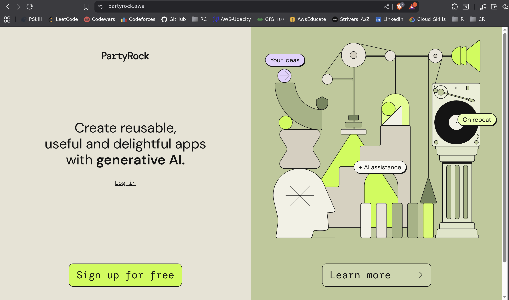
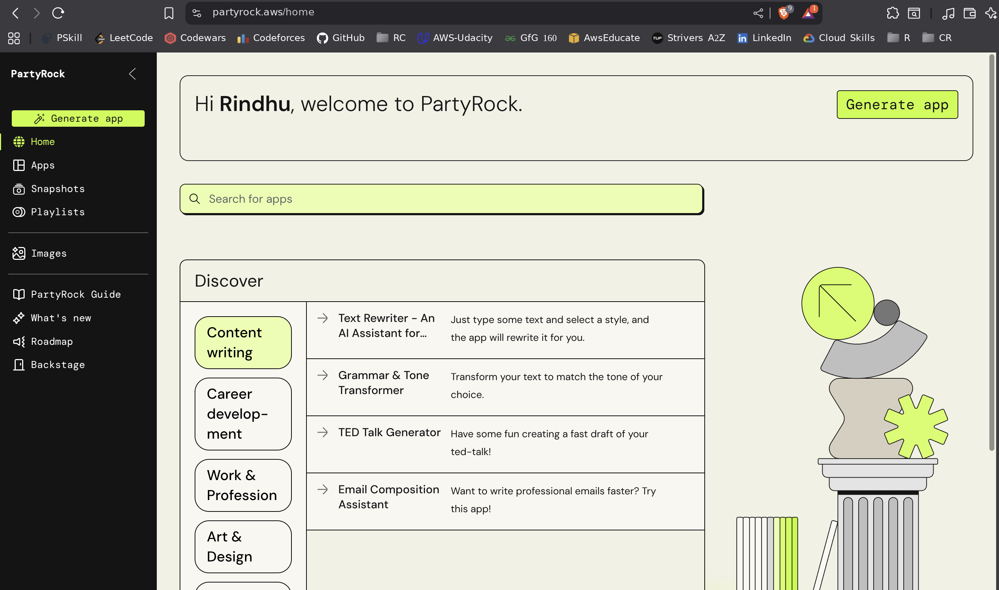
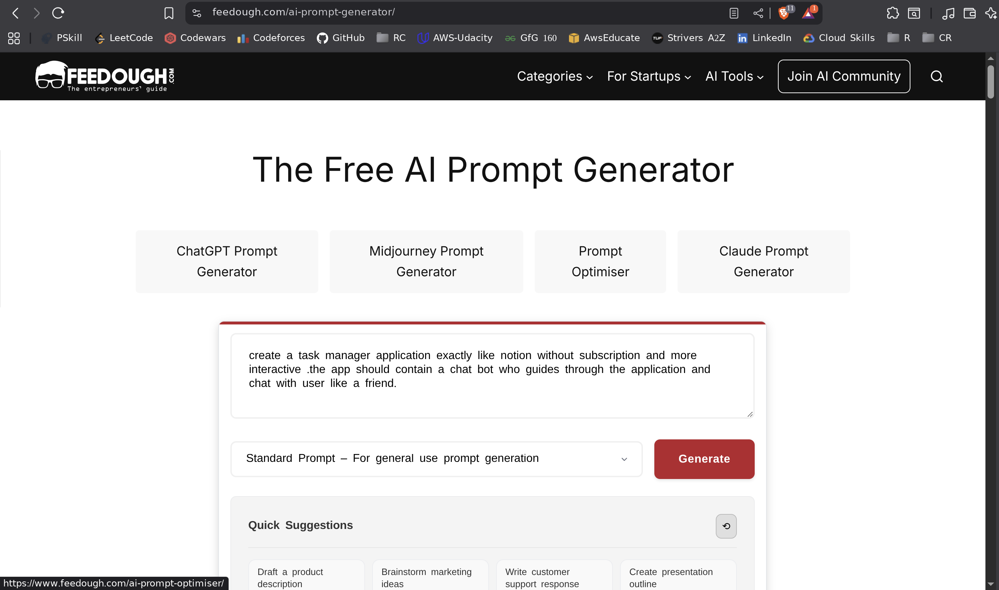
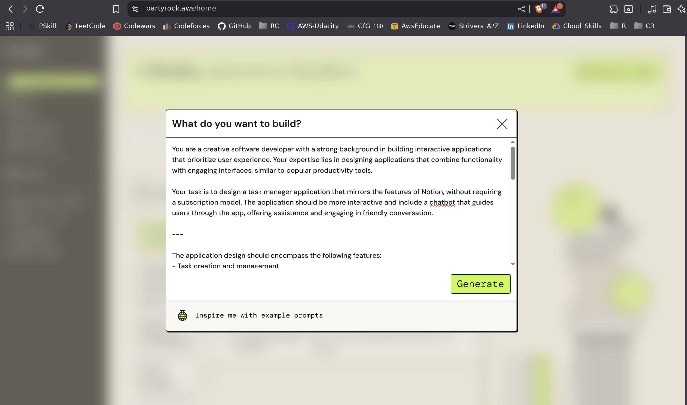
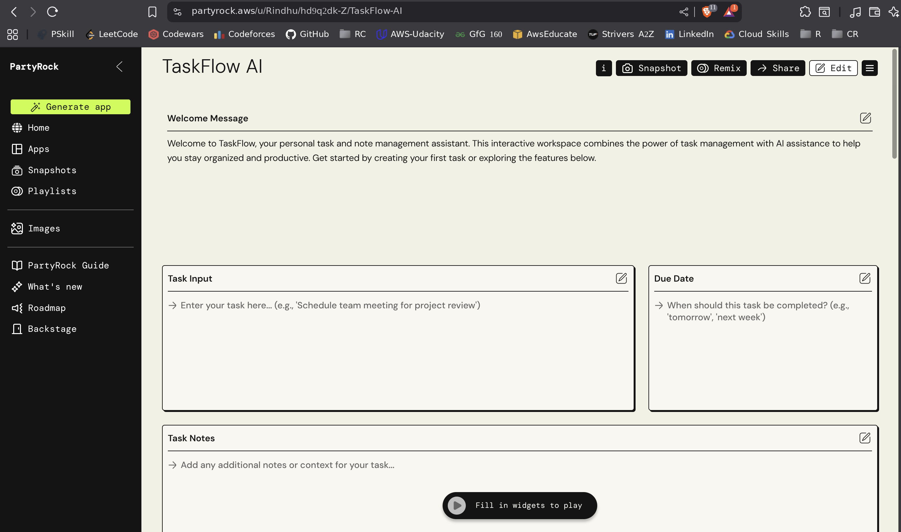
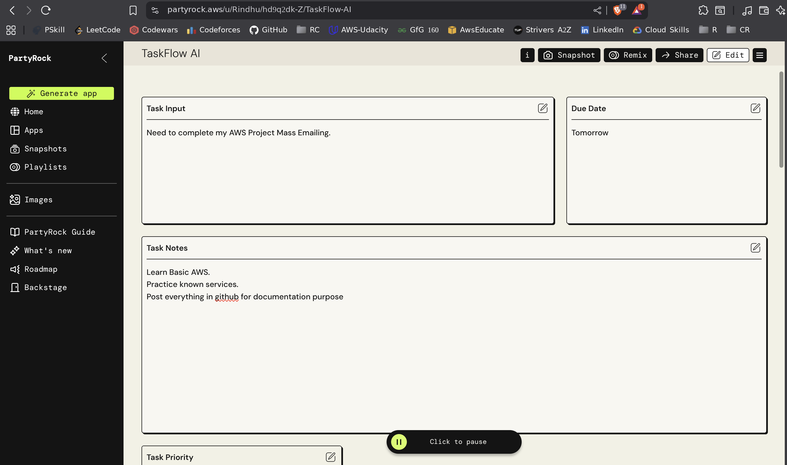
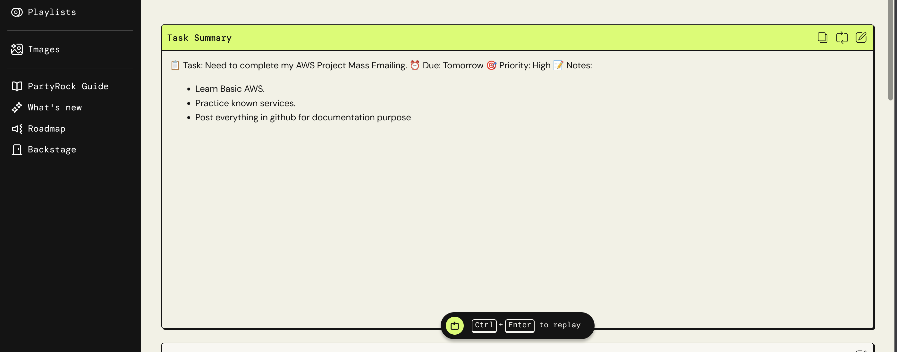
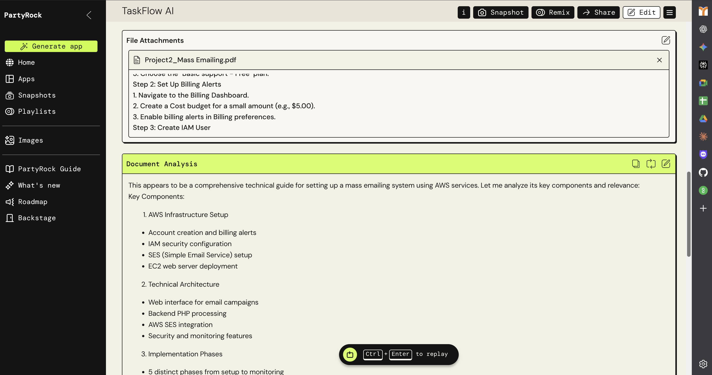
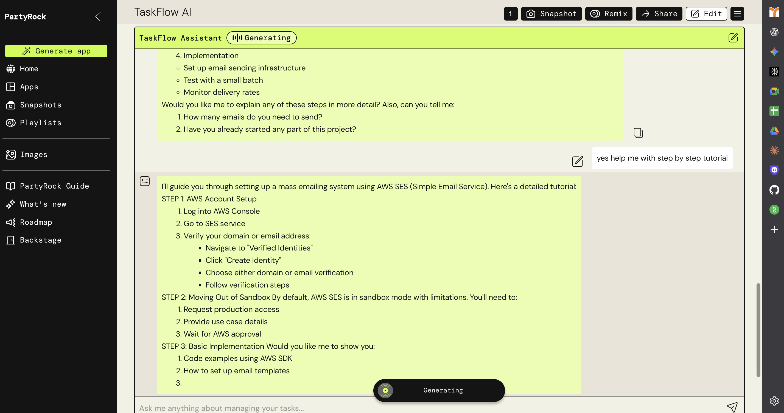
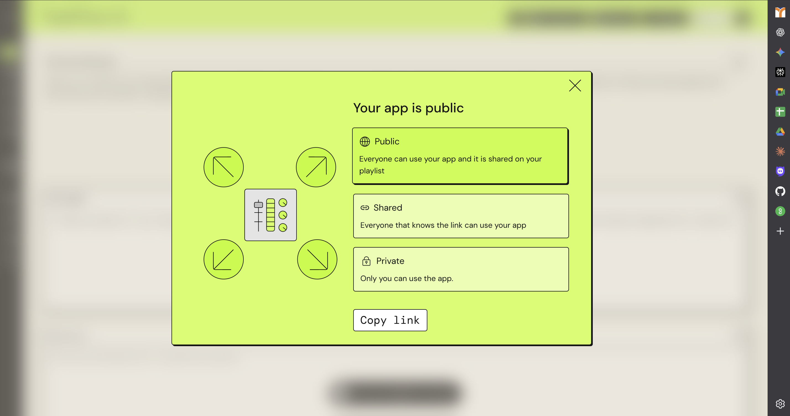

# TaskFlow AI - Intelligent Task Manager with AWS PartyRock

## Introduction to AWS PartyRock
AWS PartyRock is Amazon's revolutionary no-code generative AI playground that democratizes application development. This powerful platform allows anyone, regardless of technical background, to build sophisticated AI-powered applications using a simple drag-and-drop interface.

### What Makes PartyRock Special?
PartyRock eliminates the traditional barriers to AI application development:
- **No Programming Required** - Visual interface replaces complex coding
- **Instant AI Integration** - Built-in access to powerful language models
- **Rapid Prototyping** - From idea to working app in minutes
- **Community Sharing** - Easy collaboration and remixing features

---

## Project Overview: TaskFlow AI
TaskFlow AI represents the perfect intersection of productivity and artificial intelligence. This application demonstrates how modern no-code platforms can create enterprise-level functionality with consumer-friendly simplicity.

 **[Try TaskFlow AI Live - Click Here!](https://partyrock.aws/u/Rindhu/hd9q2dk-Z/TaskFlow-AI)**

---

##  Core Features

### 🔹 Smart Task Management
- Intuitive task input with name, priority, and due date
- AI-powered task summaries and insights
- Intelligent categorization and organization

### 🔹 Interactive AI Assistant
- Conversational chatbot interface
- Personalized task guidance and recommendations
- Motivational support and productivity tips

### 🔹 Document Intelligence
- Automatic goal extraction from uploaded documents
- Key insight summarization
- Action item identification

---

## 🛠 Step-by-Step Creation Guide

### Step 1: Accessing AWS PartyRock and Account Setup
1. Navigate to the official [AWS PartyRock](https://partyrock.aws) website
2. Click on **Get Started** or **Sign In**
3. Choose your preferred login method:
   - Amazon account (recommended for AWS ecosystem integration)
   - Google account
   - Other supported providers

**First-Time User Experience:**  
The dashboard features:
- A clean, intuitive canvas for building applications
- Widget library on the side
- Recent projects and templates
- Community featured applications
- 

---

### Step 2: Intelligent App Generation with Professional Prompting
Instead of manually creating components, let PartyRock generate your app from a **professional prompt**.

**How it Works:**
- Input your idea: e.g., *"task manager with chatbot"*
- Use [Feedough AI Prompt Generator](https://www.feedough.com/ai-prompt-generator/) for enhancement
- Copy the detailed, structured output prompt

PartyRock then generates:
- Input widgets (text fields, dropdowns, date pickers)
- Output components (summaries, insights)
- Chatbots and interactive elements
- Logical connections between all parts

 

---

### Step 3: Application Generation and Immediate Results
1. Paste your **professional prompt** into PartyRock
2. Click **Generate** and wait ~30-60 seconds

**Behind the Scenes:**
- PartyRock analyzes your prompt
- Builds UI widgets and logic
- Creates a working prototype instantly

**Your App Includes:**
- **Inputs**: Task name, due date, priority, document upload
- **Processing**: Task summary, document goal extraction, recommendations
- **Interactive**: TaskFlow chatbot, guidance system, user controls

✔️ Immediately ready to use!

---

### Step 4: Sharing and Public Access
1. Click the **Share Button** (top-right)
2. Select **Make Public**
3. Copy the **URL** and share it

**Benefits of Sharing:**
- No login required for users
- Works on all devices
- Professional, polished UI
- Community features like remixing & feedback

**Use Cases:**
- Portfolio showcase
- Team productivity tool
- Educational demo
- Community contribution

---

## Conclusion

### Beyond TaskFlow AI - Your Gateway to Infinite Possibilities
TaskFlow AI is just the beginning! You can create virtually any application in minutes:

**Quick Examples:**
- Recipe Generator – input ingredients → get recipes (5 min)
- Fitness Coach – workout planner with chatbot (3 min)
- Travel Planner – itinerary creator (7 min)
- Study Buddy – quiz generator & tutor (4 min)

---

